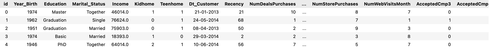
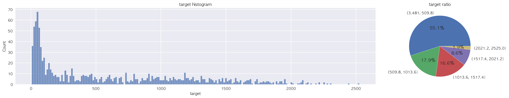
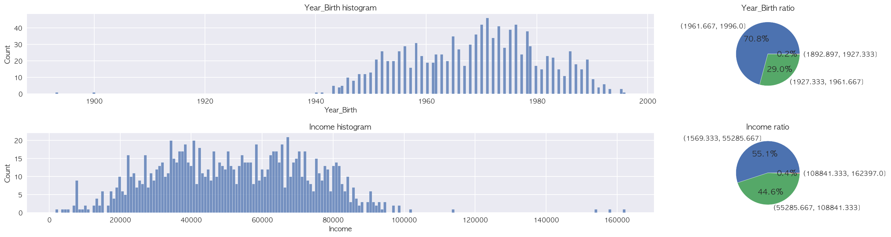
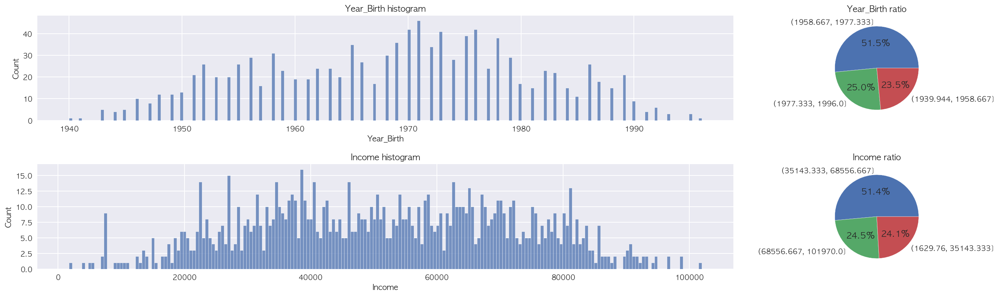
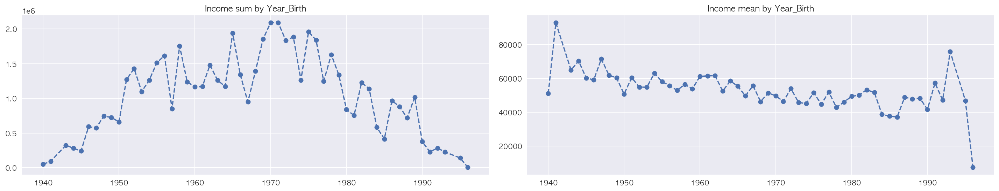
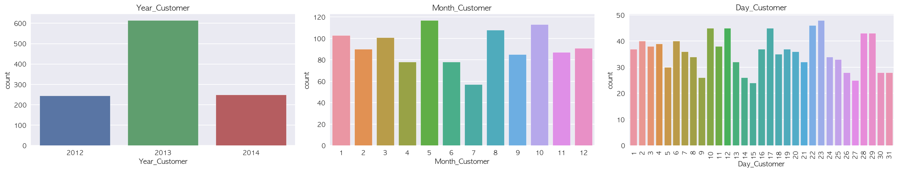
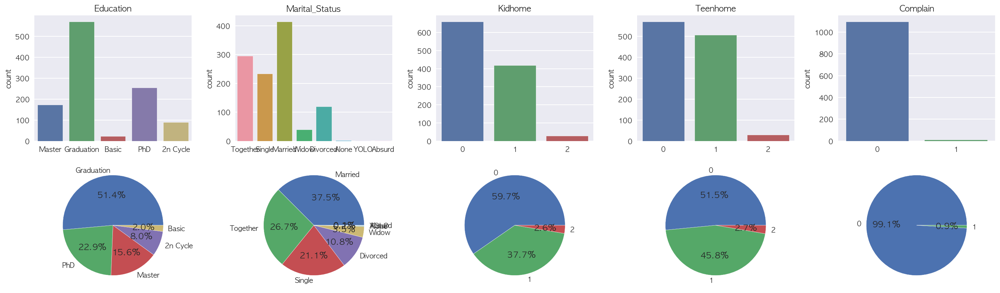
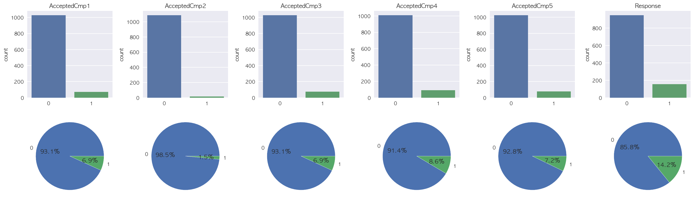

# Predict Cons
  - [분석 목표 및 결과](#분석-목표-및-결과)
  - [학습 데이터](#학습-데이터)
  - [EDA](#eda)
    - [Target](#target)
    - [출생 연도와 소득](#출생-연도와-소득)
    - [구매 건수](#구매-건수)
    - [고객 등록 일자](#고객-등록-일자)
    - [범주형 데이터](#범주형-데이터)
  - [데이터 전처리](#데이터-전처리)
  - [모델 최적화](#모델-최적화)
  - [회고](#회고)

---

## 분석 목표 및 결과

- 소비자 데이터를 바탕으로 고객의 제품 총 소비량을 예측
- 팀 프로젝트를 통해 습득한 EDA 시각화를 최대한 활용해보는 것을 목적으로 진행
- Ensemble 기법 중 Soft Voting 방식을 사용해 NMAE 기준 `0.18533` 수치를 달성하여 36위를 기록

---

## 학습 데이터

- [소비자 데이터](https://dacon.io/competitions/official/235893/data)
- 베이스라인에서 데이터 결측치가 없음을 확인받고 전처리 없이 EDA 진행

---

## EDA

### Target

- 예측해야할 소비량 데이터는 6부터 2525 사이의 범위에 존재하며,
전체 데이터 중 50퍼센트 이상이 500 이하의 값에 편향됨을 확인

### 출생 연도와 소득

- 출생 연도와 소득 데이터에서 이상치가 있음을 확인하고 해당 데이터를 제외한 그래프를 새롭게 표시
- 두 데이터 간에 관계가 있음을 기대하며 출생 연도에 따른 소득의 총합과 평균값 그래프를 추가로 표시
- 중년층에서 가장 높은 소득이 나타남을 알 수 있었고, 청년층과 노년층에서는 반대의 결과를 확인
    
    
    
    
    
    
    

### 구매 건수

- 구매 건수 데이터에서도 일부 이상치가 발생하는 것을 확인했지만,
이상치의 수가 무시할 수는 없는 수준이고 실제로 이상치를 남겨둔 경우에 더 높은 성능이 나오는 것을 확인
    
    
    

### 고객 등록 일자

- 문자열로 된 날짜 데이터를 분리해 연, 월, 일에 해당하는 데이터를 각각 그래프로 표시
    
    
    

### 범주형 데이터

- 나머지 범주형 데이터도 그래프로 표시하여 각 범주의 분포를 확인
- 결혼 상태 데이터에 한해서 같은 종류의 범주를 하나로 묶어서 분석할 수 있는 가능성 인지
    
    
    
    
    

---

## 데이터 전처리

- 문자열로 된 범주형 데이터에 Label Encoding 적용
- 더욱 다양한 특징을 보여주기 위해 기존 변수들로부터 파생 변수 생성
- train 데이터에 한정해서 출생 연도와 소득에서 발견된 이상치 제거
- 숫자형 데이터와 범주형 데이터에 각각 Standardization 및 One-Hot Encoding 적용

---

## 모델 최적화

- Pycaret으로 해당 데이터에서 회귀 모델 간 비교를 진행하여 가져갈 모델 선택
- 각각의 모델에 대해 NMAE 점수를 기준으로 Optuna를 사용하여 하이퍼파라미터 튜닝
- 개별 모델의 모든 조합에 대해 Soft Voting을 시도하였을 때,
LGBM, XGB, CatBoost, GBR의 조합이 가장 높은 성능을 보여줌을 확인
- 마찬가지로 Hard Voting 방식을 사용해 모든 조합에 대해 비교해봤지만 Soft Voting의 성능엔 못미침

---

## 회고

- 머신러닝에 대한 깊이가 깊지 않다보니 매번 Ensemble을 진행할 때 모든 경우에 대해 확인해 보는데,
해당 작업에 긴 시간이 요구되고 자원 사용량도 만만치 않기에 다른 방법을 탐색할 필요성을 느낌
- 순위가 매겨지는 대회에 참가해보니 아직 많이 부족함을 느낌